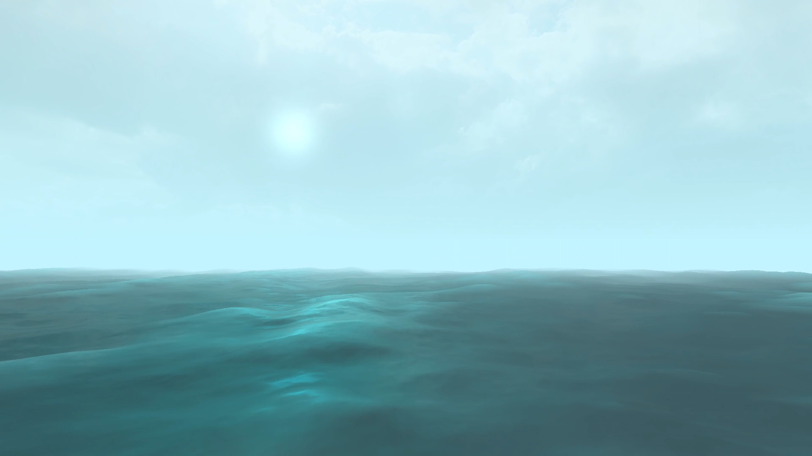

# WATER SHADER
water shader based on the sum of sines model. not realistic but produces good enough looking waves.

F1 -> memory + time statistics

F2 -> parameters

### REFERENCES
there are a few links dotted around the code here and there but these are the important one is [GpuGems](https://developer.nvidia.com/gpugems/gpugems/part-i-natural-effects/chapter-1-effective-water-simulation-physical-models).
it explains all the math behind the implementation, although not much about lighting other than normals.

# NOTES FOR MYSELF FOR FUTURE PROJECTS
### in case i want to base any future projects on this one keep some stuff in mind:
- performance.

didnt really think too much about shader performance here, optimisation is needed.
mainly adding levels of detail for the water, along with some other shader optimisations that i have added notes to here and there (though they are not exhaustive)

- the arenas solution.

it is smart, but here a lot of memory goes to arenas that get stuff allocated to them for a single task, and then are never used again.
thus, wasting permenant memory. ideally, i would add a frame arena in permenant memory (i did add some notes about that in the code) that is cleared at the start of every frame.
however, that kind of conflicts with the idea of transient memory and having it separate from permenant memory in the first place.
like, why use transient memory when you can use the frame arena to the same effect?
another thing is dynamic arrays. they are essentially unusable with this memory model. figure out how to do those properly

- the game state struct.

should it be passed in as a parameter to each function that needs it or not?
should it be a global variable or not?
should it be one large struct filled with all the variables, or should it house smaller structs for organisation?
etc etc.

- the platform layer.

currently consists of only disk operations. should probably be extended to some other stuff, although that might be unnecessary
